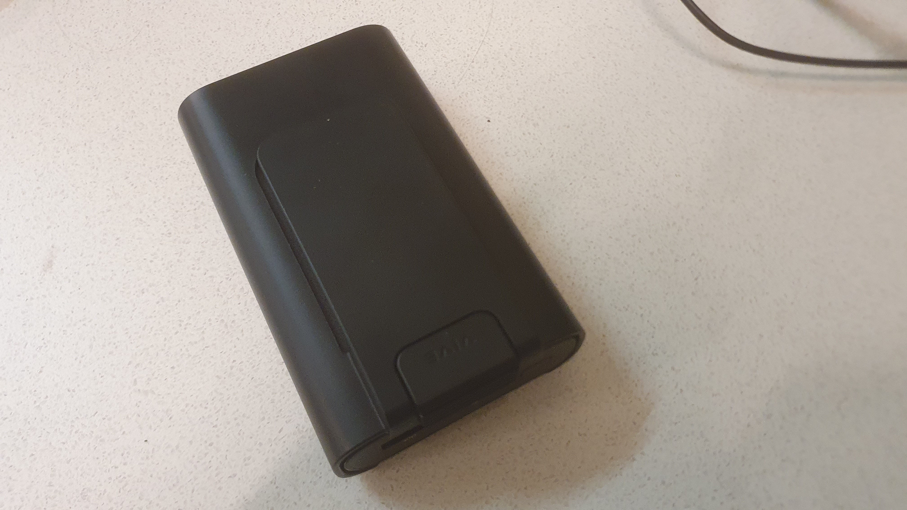

# Power Bank

## Description

This power bank is used to power the [vive wireless module](/docs/items/vive-wireless-module) via  a 
[usb a cable](/docs/items/usb-a-to-usb-a). The powerbank charges via the short 
[usb c cable](/docs/items/usb-c-to-usb-a).
