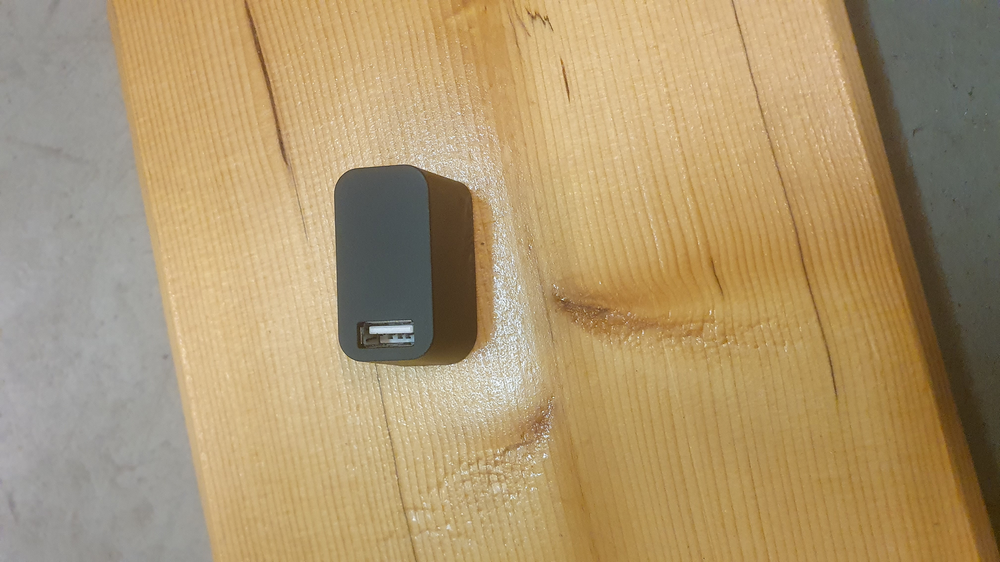

# Vive Tracker Dock

## Description

The naming in the documentation may be a bit confusing. It is not really a dock for the tracker but instead a dock 
for the tracker dongle. 

## Ports

### Connection port

This port is used to connect the dock to the computer with [usb-c-to-usb-a](/docs/items/usb-c-to-usb-a)

### Dock port

The [vive tracker dongle](/docs/items/vive-tracker-dongle) connects to via the usb a port on the top.
