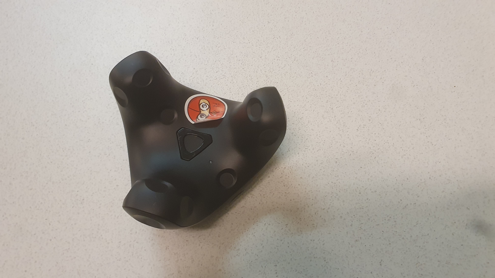

# Vive Tracker

## Sticker

Every one of these Tracker have specific stickers. One of them can be seen in the image. Those are labeled with R, L,
H or nothing.

### Meanings

| Label | Meaning                       |
|-------|-------------------------------|
| H     | Tracker for the hip ("Hüfte") |
| R     | Tracker for the right Foot    |
| L     | Tracker for the left Foot     |

## Related items to the tracker

- Vive Tracker Dongle
- Vive Tracker Dock
- Vive Tracker Foot Straps
- Vive Tracker Belt Straps

## Ports

### Charging port

The charging port is usb-c you can use any usb cable to charge them. See [here](/docs/items/usb-c-cable)
