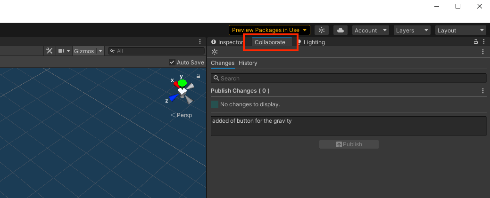
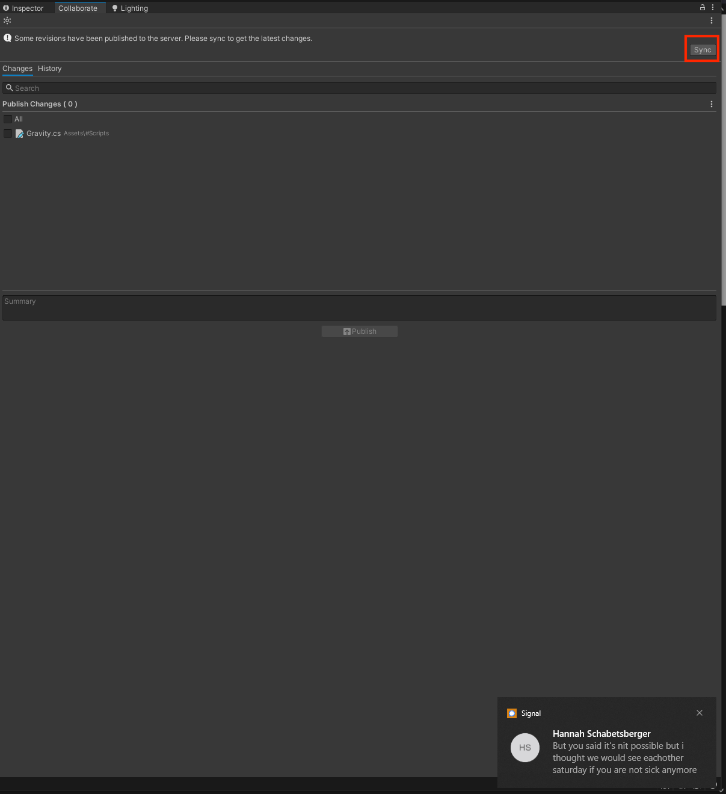
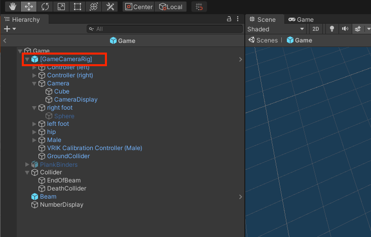
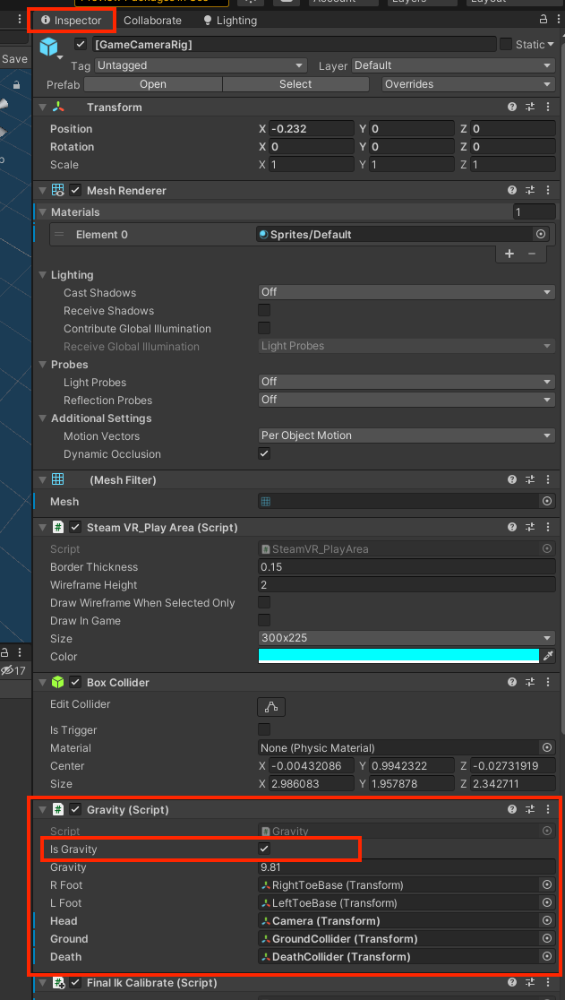

# Disable Gravity

## Open the unity editor

This is already described [here](../start-application/#build-it-yourself). But it we gonna turn of the gravity and 
then build it.

## Update the project

You may need to update the project with collaborate. Navigate into the right window and click collaborate.

Now you can press the sync button to sync you project with the project on the cloud

## Open Prefab

This sounds very complex but it isn't. Navigate into `Assets > #Prefabs > SteamVR` and open the file named `Game`.

## Select the Camera rig object in the object viewer

Right of the Scene viewer you can see the object viewer. Select the second object in it (`[GameCameraRig]`).

## Disable the gravity

Switch back to the inspector in the top right of the window and scroll down to the gravity script. There should be 
an option to `isGravity` which can be turned on and off. By default, it is on. If you want ot turn it of uncheck the 
checkbox.

