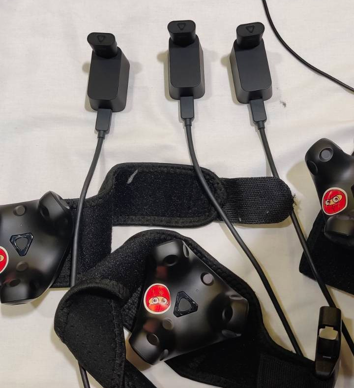
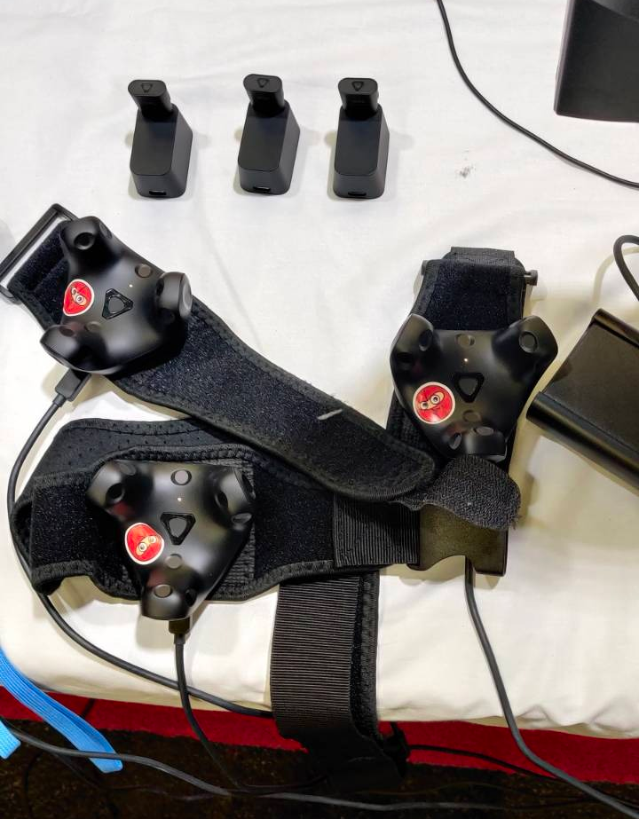

# Setup Tracker

## 1. Connect the tracker cables to the pc

For this step there should be a usb - hub in the box or already on the pc. This usb hub has 4 USB ports. Use those 
to connect the tracker cables ([long usb c](/docs/items/usb-c-to-usb-a)).

## 2. Connect the cables to the dock or the tracker for charging

### 2.1 Connect the cables to the dock

This should be done when the trackers are in use. This way the trackers are connected wireless to the pc.

### 2.2 Connect the cables to the tracker for charging

This should be done when the trackers are not in use and need charge.

