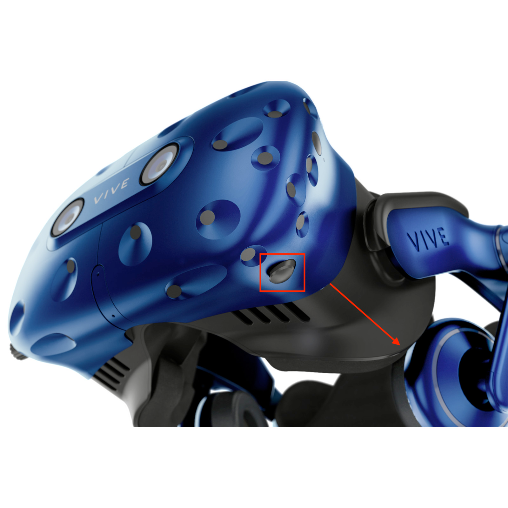

# Setup VR Glasses Wireless

## 1. Set up the wireless linkbox

Find the [wireless linkbox](/docs/items/vive-wireless-linkbox) and connect the cable to the 
[wireless card](/docs/items/vive-wireless-card). Then place it on the screen.

## 2. Mount the wireless module

Find the [wireless module](/docs/items/vive-wireless-module) and mount it on the 
[vive headset](/docs/items/vive-vr-glasses).

## 3.Connect the wireless module to the htc vive

Connect the [small vive video cable](/docs/items/vive-video-cable) to the [vive headset](/docs/items/vive-vr-glasses). 
This can be difficult. You can find a button on the bottom of the headset to get the front and the back part a little 
apart. This will make a bigger gap to plug the cable in.

## 4. Connect the wireless module to power

Get the [power bank](/docs/items/power-bank), a [usb a cable](/docs/items/usb-a-to-usb-a). Then connect the usb cable to the power bank.

## 5. Start the wireless application

Once everything is done start the htc wireless application. You may need to restart steam vr.

## Note

This makes the [vive box](/docs/items/vive-box) unnecessary.
